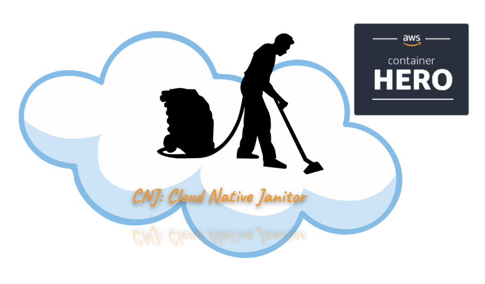
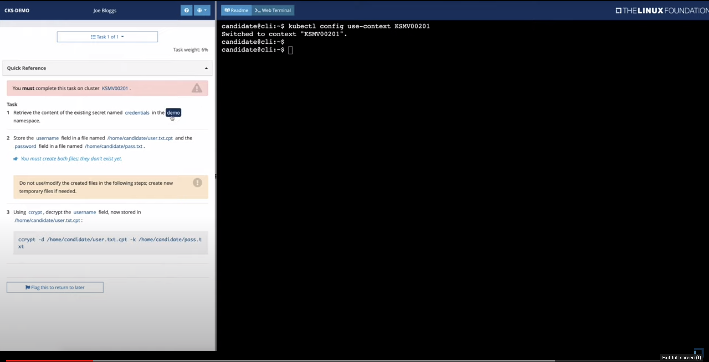
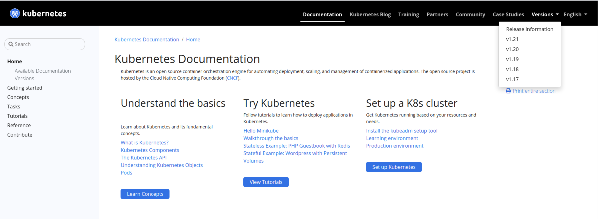

## How to connect with Walid?

  - Issues/pull requests here GitHub
  - Social networks:
    - https://www.linkedin.com/in/walidshaari/
    - https://twitter.com/walidshaari

  

## News

- Video f the [Exam environment preview](https://www.youtube.com/watch?v=9UqkWcdy140)

   

- Practice on the killer.sh when you are ready before the exam at least a week and before the exam a couple of days

   
   
 - [Top free kubernetes Certifications](https://link.medium.com/LrdvRBadbib)
 - [CNCF Certs Magic with Saiyam](https://www.youtube.com/playlist?list=PLj6h78yzYM2MOZst3T8t2qpsdwBpyxWwy)
 - [Pluralsight acquiring Acloud Guru](https://www.startupdaily.net/2021/07/us-tech-giant-pluralsight-completes-2-billion-acquisition-of-a-cloud-guru/) 
   

## Quick tips

* Ensure you are practicing using the right exam kubernetes version. as of  today, it is 1.21 and using the right 

 
* Ensure you address the right namespace and cluster always
* KISS:  Do not overthink it; start with the basics, do your backups, and remember what you practiced.
* Get familiar with the options you need and files
* Avoid spelling mistakes
* Focused troubleshooting for control-plan static manifests and kubelet: `journalctl -u kubelet`
  -  Check logs in `/var/log/pods`  or `/var/log/containers` or `crictl ps -a`, `crictl pods` or `crictl logs`
* Make sure you backup manifests/configuration files before working on them
  - While practicing, try to break working configs and check for errors, investigate them. [Klustered youtube series](https://www.youtube.com/playlist?list=PLz0t90fOInA5IyhoT96WhycPV8Km-WICj) might help you understand more the Kubernetes internals
* The exam environments should come ready with auto-completion and all command-line tools needed. Try to capitalize on that; if you can do it from the command line, no need to visit that web page; if you need that webpage, make sure you already know where in the web page is what you need, you can bookmark it if you wish.

* Enable [kubectl autocomplete](https://kubernetes.io/docs/reference/kubectl/cheatsheet/#bash). Autocomplete is the life savior in any time-bound exam and our day-to-day work (e.g., If the autocomplete enabled `k -n [Press Tab]` will suggest available namespaces). Example command to enable autocomplete is available at the official [kubectl Cheat Sheet](https://kubernetes.io/docs/reference/kubectl/cheatsheet/#bash) page; you don't have to remember anything. 
```
source <(kubectl completion bash) # setup autocomplete in bash into the current shell, bash-completion package should be installed first.
echo "source <(kubectl completion bash)" >> ~/.bashrc # add autocomplete permanently to your bash shell.

alias k=kubectl
complete -F __start_kubectl k
```
 
* Familiarize yourself with the documentation, initially [concepts](https://kubernetes.io/docs/concepts/)  and mostly [tasks](https://kubernetes.io/docs/tasks/), **kubectl explain** command, [kubectl cheatsheet](https://kubernetes.io/docs/user-guide/kubectl-cheatsheet/), and [kubectl commands reference](https://kubernetes.io/docs/reference/generated/kubectl/kubectl-commands)
  - https://kubernetes.io/docs/concepts/ 
  - https://kubernetes.io/docs/tasks/ 
  - https://kubernetes.io/docs/user-guide/kubectl-cheatsheet/
  - https://kubernetes.io/docs/reference/generated/kubectl/kubectl-commands
*  `kubectl api-versions` and `kubectl  api-resources` with `grep` for a specific resource, e.g., pv, pvc, deployment, storageclass, ..etc can help figure out the **apiVersion**, and **kind** combined with **explain** below will help in constructing the YAML manifest
* [kubectl explain --recurisve](https://blog.heptio.com/kubectl-explain-heptioprotip-ee883992a243) to construct out any yaml manifest you need and find its specs and details 
* https://medium.com/nerd-for-tech/one-cka-ckad-cks-requirement-mastering-kubectl-85486bc0a3aa
* VIM skills
  - ~/.vimrc to help with avoiding YAML mistakes 
    ```vim
    autocmd FileType yaml setlocal ts=2 sts=2 sw=2 ai et cuc
    ```

## The mindset: What to expect in CKA

 -  The course [curiculim](https://github.com/cncf/curriculum), [FAQ](https://docs.linuxfoundation.org/tc-docs/certification/faq-cka-ckad-cks)
 -  [What Clusters we will have?](https://docs.linuxfoundation.org/tc-docs/certification/tips-cka-and-ckad#cka-and-ckad-environment)
 -  Other webinars to watch [Preparing for Kubernetes Certification Exams - Tim Serewicz, The Linux Foundation
](https://youtu.be/3CmIwjGZVJ0)
 -  Courses: see main repo [README.md Training section](../../README.md#popular-training-and-practice-sites)
 - More tips and tricks: see main repo [README.md Tips section](../../README.md#tips)

## Learn Vagrant

- [Learn Vagrant](https://learn.hashicorp.com/vagrant)
- [vagrant cheet sheet](https://gist.github.com/wpscholar/a49594e2e2b918f4d0c4)

## workshop start 

```bash
git clone https://github.com/walidshaari/Kubernetes-Certified-Administrator
cd Kubernetes-Certified-Administrator/labs/kubeadm-cluster
vagrant global-status    # Check if any vagrant machines are up and where
vagrant up
vagrant ssh    # will take you the control plane as it is the vagrant default node
```

## 1- etcd
  
- Documentation:  
   - https://kubernetes.io/docs/tasks/administer-cluster/configure-upgrade-etcd/#backing-up-an-etcd-cluster
   - https://etcd.io/docs/v3.5/op-guide/recovery/#restoring-a-cluster

- Why etcd backup/restore?
  point of time copy of the cluster state

- is it enough?

-  Day 2 operations, required for resiliency, done periodically and before upgrades or maintenance updates
 ### Components
   - command-line tool: etcdctl
     
     `kubectl exec -n kube-system -it etcd-control-plane -- etcdctl version`
   - etcd manifest and the special `--data-dir` 
   - hostPath volume  /var/lib/etcd
   - ETCD Certfificates:  CA, Server cert and key
   - etcd static pod manifest: /etc/kubernetes/manifests/etcd.yaml
     - --listen-client-urls
     - image version
     - --cert-file
     - --key-file
     - --trusted-ca-file
     - --data-dir
     - 
- :triangular_flag_on_post: etcdctl --help    # get to know your tools [kubectl](https://medium.com/nerd-for-tech/one-cka-ckad-cks-requirement-mastering-kubectl-85486bc0a3aa) `etcdctl` `vim` `tmux`,...etc
  ```bash
  root@control-plane:~# kubectl exec -n kube-system -it etcd-control-plane -- etcdctl --help|grep snapshot
	snapshot restore	Restores an etcd member snapshot to an etcd directory
	snapshot save		Stores an etcd node backend snapshot to a given file
	snapshot status		Gets backend snapshot status of a given file
  
  
  kubectl exec -n kube-system -it etcd-control-plane -- etcdctl \
  --cacert=/etc/kubernetes/pki/etcd/ca.crt \
  --cert=/etc/kubernetes/pki/etcd/server.crt  \
  --key=/etc/kubernetes/pki/etcd/server.key \
  --write-out=table \
  member list
  
  +-----------------+---------+---------------+------------------------+------------------------+------------+
  |       ID        | STATUS  |     NAME      |       PEER ADDRS       |      CLIENT ADDRS      | IS LEARNER |
  +-----------------+---------+---------------+------------------------+------------------------+------------+
  | 3b17aaa147134dd | started | control-plane | https://10.0.0.10:2380 | https://10.0.0.10:2379 |      false |
  +-----------------+---------+---------------+------------------------+------------------------+------------+
  
  ## if default --write-out it would be simple like below
  ###  https://stackoverflow.com/questions/63433622/is-the-following-output-of-etcdctl-member-list-correct-and-etcd-cluster-is-in
  3b17aaa147134dd, started, control-plane, https://10.0.0.10:2380, https://10.0.0.10:2379, false

  ```

### Possible task
  
  - backup cluster, etcd data and save it in the base/jump host at specific directory. in our case  /vagrant/snapshots/etcd-snapshot.db
  - restore cluster etcd data from /vagrant/backup/islamabad-restore.db and verify you have the namespace CKA and deployment islamabad-nginx and its associated services
  
    - first check if you have any of the two namespaces cka, or dammam-cnj, if you do delete the objects
      ```bash
      
      # delete cka and dammam-cnj namespaces if they exist
      # as user vagrant in the vagrant home directory
      
      vagrant@control-plane:~$ cd
            
      vagrant@control-plane:~$ pwd
      /home/vagrant
      
      vagrant@control-plane:~$ kubectl delete  -f /vagrant/apps/dammam-cnj/
      vagrant@control-plane:~$ kubectl delete  -f /vagrant/apps/islamabad-app/
            
    ```
  - if you have a clean setup/environment start the etcd exercise
    
    ```bash
    vagrant@control-plane:~$ /vagrant/scripts/etcd-prep.sh 
    namespace/cka created
    deployment.apps/islamabad-app created
    configmap/islamabad-db-configmap created
    deployment.apps/postgres-db created
    
    ```
    
  - examine what API resources and objects are available in the cluster?
    ```bash
    vagrant@control-plane:~$ kubectl get all -n cka
    NAME                            READY   UP-TO-DATE   AVAILABLE   AGE
    deployment.apps/islamabad-app   0/0     0            0           2m5s
    deployment.apps/postgres-db     0/0     0            0           2m5s

    NAME                                       DESIRED   CURRENT   READY   AGE
    replicaset.apps/islamabad-app-55f4844967   0         0         0       2m5s
    replicaset.apps/postgres-db-6cb54bbb96     0         0         0       2m5s
    
    ```
    
  - When you are done exploring, **restore** from /vagrant/backup/islamabad-restore.db 
  - check the control-plane pods
  - check the API objects in CKA namespace

##### Save ETCD data snapshot


- Save/backup a snapshot of etcd:  `etcdctl --endpoints snapshot save <filename>` 

```bash

################################  backup #################
$ sudo etcdctl --cacert=/etc/kubernetes/pki/etcd/ca.crt \
  --cert=/etc/kubernetes/pki/etcd/server.crt \
  --key=/etc/kubernetes/pki/etcd/server.key\
  snapshot save /vagrant/snapshots/etcd-backup.db

{"level":"info","ts":1627240895.1983745,"caller":"snapshot/v3_snapshot.go:119","msg":"created temporary db file","path":"/vagrant/snapshots/etcd-backup.part"}
{"level":"info","ts":"2021-07-25T19:21:35.212Z","caller":"clientv3/maintenance.go:200","msg":"opened snapshot stream; downloading"}
{"level":"info","ts":1627240895.2146122,"caller":"snapshot/v3_snapshot.go:127","msg":"fetching snapshot","endpoint":"127.0.0.1:2379"}
{"level":"info","ts":"2021-07-25T19:21:35.325Z","caller":"clientv3/maintenance.go:208","msg":"completed snapshot read; closing"}
{"level":"info","ts":1627240895.3396266,"caller":"snapshot/v3_snapshot.go:142","msg":"fetched snapshot","endpoint":"127.0.0.1:2379","size":"5.2 MB","took":0.141213026}
{"level":"info","ts":1627240895.339843,"caller":"snapshot/v3_snapshot.go:152","msg":"saved","path":"/var/lib/etcd-backup"}
Snapshot saved at /vagrant/snapshots/etcd-backup


###################### Verify your snapshot save  ############
$ sudo etcdctl --cacert=/etc/kubernetes/pki/etcd/ca.crt \
  --cert=/etc/kubernetes/pki/etcd/server.crt \
  --key=/etc/kubernetes/pki/etcd/server.key    \
  snapshot status  --write-out=table /vagrant/snapshots/islamabad-app.db   #write-out option makes it easy to understand output data
+----------+----------+------------+------------+
|   HASH   | REVISION | TOTAL KEYS | TOTAL SIZE |
+----------+----------+------------+------------+
| 5e82f815 |     6726 |       1495 |     5.4 MB |
+----------+----------+------------+------------+

```

- Restore a snapshot of etcd: 
  - restore the backup to another location   
    - you can use the new location if you modify the etcd datadirectory configuration in the etcd pod manifest 
  - move the original etcd cluster data out of the way
  - stop etcd
  - move the restored data to the etcd datadirectory  /var/lib/etcd
  - startup etcd
- 
- `etcdctl --endpoints snapshot restore <filename>` 

```bash

$ etcdctl version

$ kubectl get pods -n kube-system|grep etcd
  etcd-control-plane                         1/1     Running   1          11d

$ kubectl describe -n kube-system pod etcd-control-plane 

Name:                 etcd-control-plane
Namespace:            kube-system
Priority:             2000001000
Priority Class Name:  system-node-critical
Node:                 control-plane/10.0.0.10
Start Time:           Sat, 24 Jul 2021 12:17:21 +0000
Labels:               component=etcd
                      tier=control-plane
Annotations:          kubeadm.kubernetes.io/etcd.advertise-client-urls: https://10.0.0.10:2379
                      kubernetes.io/config.hash: 9d7ebe35aa278df29e333e9778092061
                      kubernetes.io/config.mirror: 9d7ebe35aa278df29e333e9778092061
                      kubernetes.io/config.seen: 2021-07-13T11:57:12.197720051Z
                      kubernetes.io/config.source: file
Status:               Running
IP:                   10.0.0.10
IPs:
  IP:           10.0.0.10
Controlled By:  Node/control-plane
Containers:
  etcd:
    Container ID:  containerd://8ea4561c3d1cfe3b6f8bf119e16b23237d222b7d2bd2fd84e5f9260a70042b9d
    Image:         k8s.gcr.io/etcd:3.4.13-0
    Image ID:      k8s.gcr.io/etcd@sha256:4ad90a11b55313b182afc186b9876c8e891531b8db4c9bf1541953021618d0e2
    Port:          <none>
    Host Port:     <none>
    Command:
      etcd
      --advertise-client-urls=https://10.0.0.10:2379
      --cert-file=/etc/kubernetes/pki/etcd/server.crt
      --client-cert-auth=true
      --data-dir=/var/lib/etcd
      --initial-advertise-peer-urls=https://10.0.0.10:2380
      --initial-cluster=control-plane=https://10.0.0.10:2380
      --key-file=/etc/kubernetes/pki/etcd/server.key
      --listen-client-urls=https://127.0.0.1:2379,https://10.0.0.10:2379
      --listen-metrics-urls=http://127.0.0.1:2381
      --listen-peer-urls=https://10.0.0.10:2380
      --name=control-plane
      --peer-cert-file=/etc/kubernetes/pki/etcd/peer.crt
      --peer-client-cert-auth=true
      --peer-key-file=/etc/kubernetes/pki/etcd/peer.key
      --peer-trusted-ca-file=/etc/kubernetes/pki/etcd/ca.crt
      --snapshot-count=10000
      --trusted-ca-file=/etc/kubernetes/pki/etcd/ca.crt
    State:          Running
      Started:      Sat, 24 Jul 2021 12:17:22 +0000
    Last State:     Terminated
      Reason:       Unknown
      Exit Code:    255
      Started:      Tue, 13 Jul 2021 11:56:58 +0000
      Finished:     Sat, 24 Jul 2021 12:17:09 +0000
    Ready:          True
    Restart Count:  1
    Requests:
      cpu:                100m
      ephemeral-storage:  100Mi
      memory:             100Mi
    Liveness:             http-get http://127.0.0.1:2381/health delay=10s timeout=15s period=10s #success=1 #failure=8
    Startup:              http-get http://127.0.0.1:2381/health delay=10s timeout=15s period=10s #success=1 #failure=24
    Environment:          <none>
    Mounts:
      /etc/kubernetes/pki/etcd from etcd-certs (rw)
      /var/lib/etcd from etcd-data (rw)
Conditions:
  Type              Status
  Initialized       True 
  Ready             True 
  ContainersReady   True 
  PodScheduled      True 
Volumes:
  etcd-certs:
    Type:          HostPath (bare host directory volume)
    Path:          /etc/kubernetes/pki/etcd
    HostPathType:  DirectoryOrCreate
  etcd-data:
    Type:          HostPath (bare host directory volume)
    Path:          /var/lib/etcd
    HostPathType:  DirectoryOrCreate
QoS Class:         Burstable
Node-Selectors:    <none>
Tolerations:       :NoExecute op=Exists
Events:            <none>

###################################################
# ETCD Network ports
# hostNetwork: true

root@control-plane:~# ss -tulpn|grep 2379
tcp   LISTEN   0        128              127.0.0.1:2379           0.0.0.0:*      users:(("etcd",pid=2047,fd=6))                                                 
tcp   LISTEN   0        128              10.0.0.10:2379           0.0.0.0:*      users:(("etcd",pid=2047,fd=5))                                                 
root@control-plane:~# ss -tulpn|grep 2380
tcp   LISTEN   0        128              10.0.0.10:2380           0.0.0.0:*      users:(("etcd",pid=2047,fd=3)) 


#########################
# get ETCD configuration paramters othern than "kubectl pod describe/view etcd manifest"
$ ps auxw|grep 'etcd '|grep -v grep
root      2047  1.8  3.5 10612728 72536 ?      Ssl  12:17   4:55 etcd --advertise-client-urls=https://10.0.0.10:2379 --cert-file=/etc/kubernetes/pki/etcd/server.crt --client-cert-auth=true --data-dir=/var/lib/etcd --initial-advertise-peer-urls=https://10.0.0.10:2380 --initial-cluster=control-plane=https://10.0.0.10:2380 --key-file=/etc/kubernetes/pki/etcd/server.key --listen-client-urls=https://127.0.0.1:2379,https://10.0.0.10:2379 --listen-metrics-urls=http://127.0.0.1:2381 --listen-peer-urls=https://10.0.0.10:2380 --name=control-plane --peer-cert-file=/etc/kubernetes/pki/etcd/peer.crt --peer-client-cert-auth=true --peer-key-file=/etc/kubernetes/pki/etcd/peer.key --peer-trusted-ca-file=/etc/kubernetes/pki/etcd/ca.crt --snapshot-count=10000 --trusted-ca-file=/etc/kubernetes/pki/etcd/ca.crt


##################################


# No need to set the API env variable ETCDCTL_API to 3, it defaults to 3 now  
etcdctl version: 3.4.10
API version: 3.4

a key to verifiy backup
etcdctl  get cluster.name --endpoints=https://10.0.1.101:2379 --cacert=./etcd-ca.pem --cert=etcd-server.crt --key=etcd-server.key
cluster.name
beebox


etcdctl snapshot save /home/cloud_user/etcd_backup.db  --endpoints=https://10.0.1.101:2379 --cacert=./etcd-ca.pem --cert=etcd-server.crt --key=etcd-server.key
sudo etcdctl snapshot restore  /home/cloud_user/etcd_backup.db  --initial-cluster etcd-restore=https://10.0.1.101:2380 --initial-advertise-peer-urls https://10.0.1.101:2380 --name etcd-restore --data-dir /var/lib/etcd
sudo chown etcd:etcd  /var/lib/etcd/

```
## 2- Networking

### Network policy tutorial
-  https://github.com/networkpolicy/tutorial

#### Concepts
- By default all pods can communicate to all pods in all namespaces unless there are controls put in by the kubernetes distribution.
- first you isolate by selection, then you start allowing by 


#### Network Flow:

Ingress: 	incoming traffic to select pod in question

Egress		outgoing traffic from selected pod in question 


#### Network policy editor

- https://networkpolicy.io/


## 3- Troubleshooting

- https://kubernetes.io/docs/tasks/debug-application-cluster/debug-cluster/
- learn crictl and ctr 
   - https://portal2portal.blogspot.com/2021/06/tinkering-with-containerd-and-ctr-tool.html
   - https://kubernetes.io/docs/tasks/debug-application-cluster/crictl/
   
- lets try to break things and see what happens?

- OS related issues:
    - systemctl
    - swap memory
    - disk space
    - node conditions:
      - memory
      - disk space  

- Nodes issues
  - CNI network plugin 
  - Certficates
  - firewall rules
 
- Control-plane issues
  - kubelet
  - static manifests
 


## Todo:
- test vagrant in different Oss and after a destroy
- backup etcd CronJob
- secure your backups (encrypt them and store them in a secure location), for DR ensure you have a copy offsite
- Spice it up with Ansible/GOSS/INSPEC

